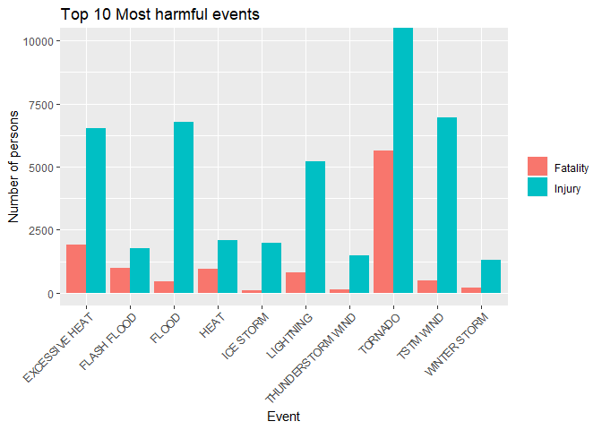
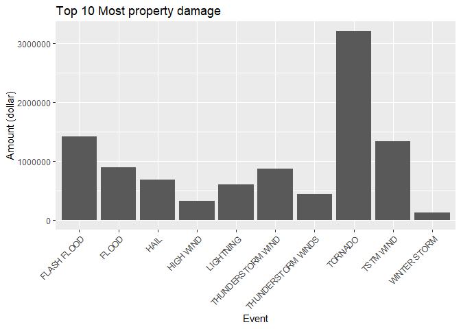

## Synopsis

We analysed the major storms and weather events in the United States using the storm database provided by the U.S. National Oceanic and Atmospheric Administration's (NOAA). In the first part, we focused to the human health in order to know which weather event casuses the lagest number of fatality and injury. In the second part, we investigate economic consequences of weather events. As a result, we conclude that tornado is the most serious event as it might not be only harmful for the human health, but also it seems to cause severe consequences in the economic aspect.

## Data processing


Preparation of packages which will be used and download the data set.


```r
library(dplyr)
library(ggplot2)
library(tidyr)
library(xtable)
```


```r
url <- "https://d396qusza40orc.cloudfront.net/repdata%2Fdata%2FStormData.csv.bz2"
download.file(url, "2FStormData.csv.bz2")
StormData <- read.csv("2FStormData.csv.bz2")
```

### Question 1

We select 3 columms of the original data set, concretly, EVTYPE, FATALITIES and INJURIES in order to the most harmful event with respect to the human health. Then, we create a new variable named "Total", which is the number of fatalities and injuries.


```r
Harmful <- StormData %>% select(EVTYPE, FATALITIES, INJURIES) %>% 
  group_by(EVTYPE) %>%
  summarise(Fatality = sum(FATALITIES),
            Injury = sum(INJURIES)) %>% 
  mutate(Total = Fatality + Injury)
```

Extract only top 10 of the Total variable to know the most harmful events.


```r
Top10Harmful <- Harmful[order(Harmful$Total, decreasing = TRUE),][1:10,]
```

Notice that here we have to transform the data frame to make a bar plot.

```r
Top10HarmfulTrans <- Top10Harmful %>%
  select(-Total) %>% 
  gather(key = type, value = number, Fatality, Injury)
```

### Question2

We select two variables: EVTYPE and PROPDMG. 

```r
PropDmg <- StormData %>% select(EVTYPE, PROPDMG) %>% 
  group_by(EVTYPE) %>% 
  summarise(Amount = sum(PROPDMG))
```

Just like the previous question, we select top 10 of the PROPDMG grouped by event type (EVTYPE).

```r
Top10Damage <- PropDmg[order(PropDmg$Amount, decreasing = TRUE),][1:10,]
```

## Results

### Question 1

This is the plot of the most harmful events.

```r
g <- ggplot(Top10HarmfulTrans, aes(EVTYPE, number,fill = type)) +
  geom_bar(stat = "identity", position = "dodge") +
  theme(axis.text.x = element_text(angle = 45, hjust = 1))  +
  coord_cartesian(ylim = c(0, 10000)) +
  labs(x = "Event", y = "Number of persons", title = "Top 10 Most harmful events") +
  guides(fill=guide_legend(title=""))
print(g)
```

<!-- -->

And this is the table of the most harmful events.

```r
t <- xtable(Top10Harmful, caption = "The most harmful event seems to be tornado. Both the number of fatality and of the injuriy are extremely high.", auto = TRUE)
print(t, type = "html")
```

<!-- html table generated in R 3.5.1 by xtable 1.8-2 package -->
<!-- Sat Aug 25 23:47:32 2018 -->
<table border=1>
<caption align="bottom"> The most harmful event seems to be tornado. Both the number of fatality and of the injuriy are extremely high. </caption>
<tr> <th>  </th> <th> EVTYPE </th> <th> Fatality </th> <th> Injury </th> <th> Total </th>  </tr>
  <tr> <td> 1 </td> <td> TORNADO </td> <td align="right"> 5633 </td> <td align="right"> 91346 </td> <td align="right"> 96979 </td> </tr>
  <tr> <td> 2 </td> <td> EXCESSIVE HEAT </td> <td align="right"> 1903 </td> <td align="right"> 6525 </td> <td align="right"> 8428 </td> </tr>
  <tr> <td> 3 </td> <td> TSTM WIND </td> <td align="right"> 504 </td> <td align="right"> 6957 </td> <td align="right"> 7461 </td> </tr>
  <tr> <td> 4 </td> <td> FLOOD </td> <td align="right"> 470 </td> <td align="right"> 6789 </td> <td align="right"> 7259 </td> </tr>
  <tr> <td> 5 </td> <td> LIGHTNING </td> <td align="right"> 816 </td> <td align="right"> 5230 </td> <td align="right"> 6046 </td> </tr>
  <tr> <td> 6 </td> <td> HEAT </td> <td align="right"> 937 </td> <td align="right"> 2100 </td> <td align="right"> 3037 </td> </tr>
  <tr> <td> 7 </td> <td> FLASH FLOOD </td> <td align="right"> 978 </td> <td align="right"> 1777 </td> <td align="right"> 2755 </td> </tr>
  <tr> <td> 8 </td> <td> ICE STORM </td> <td align="right"> 89 </td> <td align="right"> 1975 </td> <td align="right"> 2064 </td> </tr>
  <tr> <td> 9 </td> <td> THUNDERSTORM WIND </td> <td align="right"> 133 </td> <td align="right"> 1488 </td> <td align="right"> 1621 </td> </tr>
  <tr> <td> 10 </td> <td> WINTER STORM </td> <td align="right"> 206 </td> <td align="right"> 1321 </td> <td align="right"> 1527 </td> </tr>
   </table>

### Question 2

This is the plot of the events which caused the most serious economic consequences.

```r
options(scipen=100)
g2 <- ggplot(Top10Damage, aes(EVTYPE, Amount)) +
  geom_bar(stat = "identity") +
  labs(x = "Event", y = "Amount (dollar)", title = "Top 10 Most property damage") +
  theme(axis.text.x = element_text(angle = 45, hjust = 1))
print(g2)
```

<!-- -->

And this is the corresponding table.

```r
t2 <- xtable(Top10Damage, caption = "The event witch caused the most serious economic damage seems to be tornado, with 3,212,258.16 dollar", auto = TRUE)
print(t2, type = "html")
```

<!-- html table generated in R 3.5.1 by xtable 1.8-2 package -->
<!-- Sat Aug 25 23:29:07 2018 -->
<table border=1>
<caption align="bottom"> The event witch caused the most serious economic damage seems to be tornado, with 3,212,258.16 dollar </caption>
<tr> <th>  </th> <th> EVTYPE </th> <th> Amount </th>  </tr>
  <tr> <td> 1 </td> <td> TORNADO </td> <td align="right"> 3212258.16 </td> </tr>
  <tr> <td> 2 </td> <td> FLASH FLOOD </td> <td align="right"> 1420124.59 </td> </tr>
  <tr> <td> 3 </td> <td> TSTM WIND </td> <td align="right"> 1335965.61 </td> </tr>
  <tr> <td> 4 </td> <td> FLOOD </td> <td align="right"> 899938.48 </td> </tr>
  <tr> <td> 5 </td> <td> THUNDERSTORM WIND </td> <td align="right"> 876844.17 </td> </tr>
  <tr> <td> 6 </td> <td> HAIL </td> <td align="right"> 688693.38 </td> </tr>
  <tr> <td> 7 </td> <td> LIGHTNING </td> <td align="right"> 603351.78 </td> </tr>
  <tr> <td> 8 </td> <td> THUNDERSTORM WINDS </td> <td align="right"> 446293.18 </td> </tr>
  <tr> <td> 9 </td> <td> HIGH WIND </td> <td align="right"> 324731.56 </td> </tr>
  <tr> <td> 10 </td> <td> WINTER STORM </td> <td align="right"> 132720.59 </td> </tr>
   </table>
